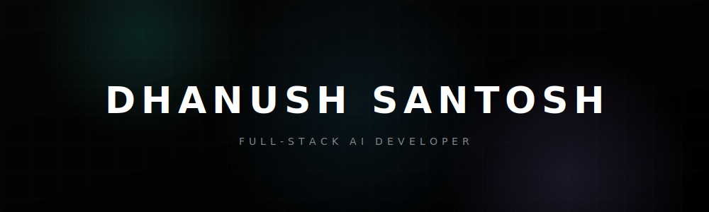

  
   
  <i>Crafting AI-native products where resilient infra, delightful UX, and reliable models operate as a single surface.</i>

---

### ✦ About Me

I'm a product-minded engineer specializing in **AI orchestration, automation workflows, and cinematic UIs**. I focus on shipping high-performance applications from the ground up—bridging data contracts, Temporal pipelines, design systems, and robust deployment architectures.

Currently building and scaling LLM copilots, realtime dashboards, and intelligent automation for B2B SaaS. Check out my full interactive portfolio at **[xerocore.in](https://xerocore.in)**.

 

### ✦ Engineering Arsenal

  

 

### ✦ Activity & Metrics

  
  

 

---

  
<b>"Let's ship something intelligent together."</b>

  

    <a href="mailto:contact@xerocore.in">contact@xerocore.in</a> • 
    <a href="https://xerocore.in">xerocore.in</a>
  

